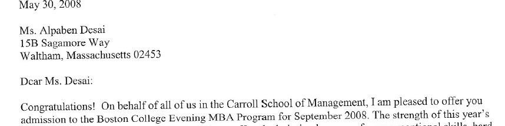

# Chartered Financial Analyst

The project provides a high level overview of the academic knowledge associated with a CFA.

## CFA

## Certificate

## Launchpad

## CFA Level I exam

## Ethics

## Tier II business school admission letter 

## Entrace exams

Additional details found in https://github.com/alpaddesai/RealEstatePortfolio, https://github.com/alpaddesai/FinancialAccountingIdea, https://github.com/alpaddesai/BusinessDevelopmentIdea, https://github.com/alpaddesai/InternationalManagerialFinance, https://github.com/alpaddesai/PredictionModelWithBloombergIdea, https://github.com/alpaddesai/FinancialMarkets, https://github.com/alpaddesai/OptimalCapitalStructure, https://github.com/alpaddesai/FinancialAdvice, https://github.com/alpaddesai/ManagerialAccounting, https://github.com/alpaddesai/CostManagement, https://github.com/alpaddesai/MergersDocumentIdea, https://github.com/alpaddesai/InvestmentPortfolio, https://github.com/alpaddesai/PortfolioReturnGUIIdea, https://github.com/alpaddesai/PowerandInfluentialSkills,  https://github.com/alpaddesai/EthicalProfessionalStandards and https://github.com/alpaddesai/BusinessNegotiations.
