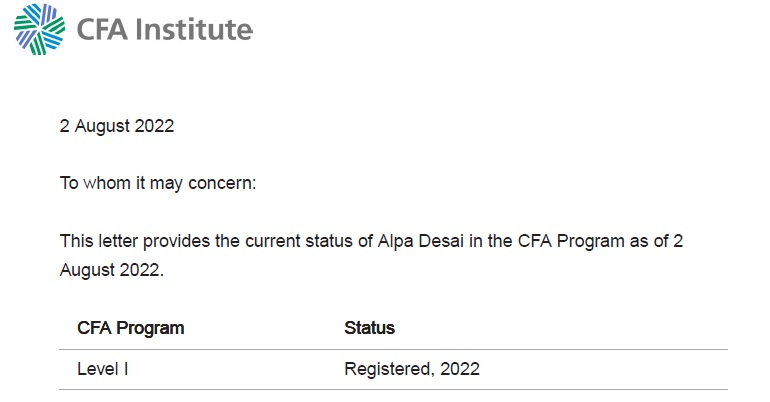

# Investment Banking 

The project provides a high level overview of the academic knowledge associated with a Investment Banking . 
All images are either custom by Alpa D Desai or a reference name is included. Most of the images are custom.

## Launchpad

## Ethics

## Exam

Additional details found in https://github.com/alpaddesai/RealEstatePortfolio, https://github.com/alpaddesai/FinancialAccountingIdea, https://github.com/alpaddesai/BusinessDevelopmentIdea, https://github.com/alpaddesai/InternationalManagerialFinance, https://github.com/alpaddesai/CharteredFinancialAnalystExam2022, https://github.com/alpaddesai/PredictionModelWithBloombergIdea, https://github.com/alpaddesai/FinancialMarkets, https://github.com/alpaddesai/OptimalCapitalStructure, https://github.com/alpaddesai/FinancialAdvice, https://github.com/alpaddesai/ManagerialAccounting, https://github.com/alpaddesai/CostManagement, https://github.com/alpaddesai/MergersDocumentIdea, https://github.com/alpaddesai/InvestmentPortfolio, https://github.com/alpaddesai/PortfolioReturnGUIIdea, https://github.com/alpaddesai/PowerandInfluentialSkills, https://github.com/alpaddesai/EthicalProfessionalStandards, https://github.com/alpaddesai/BigDataDataScience, https://github.com/alpaddesai/GraduateManagementAptitudeTest and https://github.com/alpaddesai/RealEstatePortfolioIdea.
